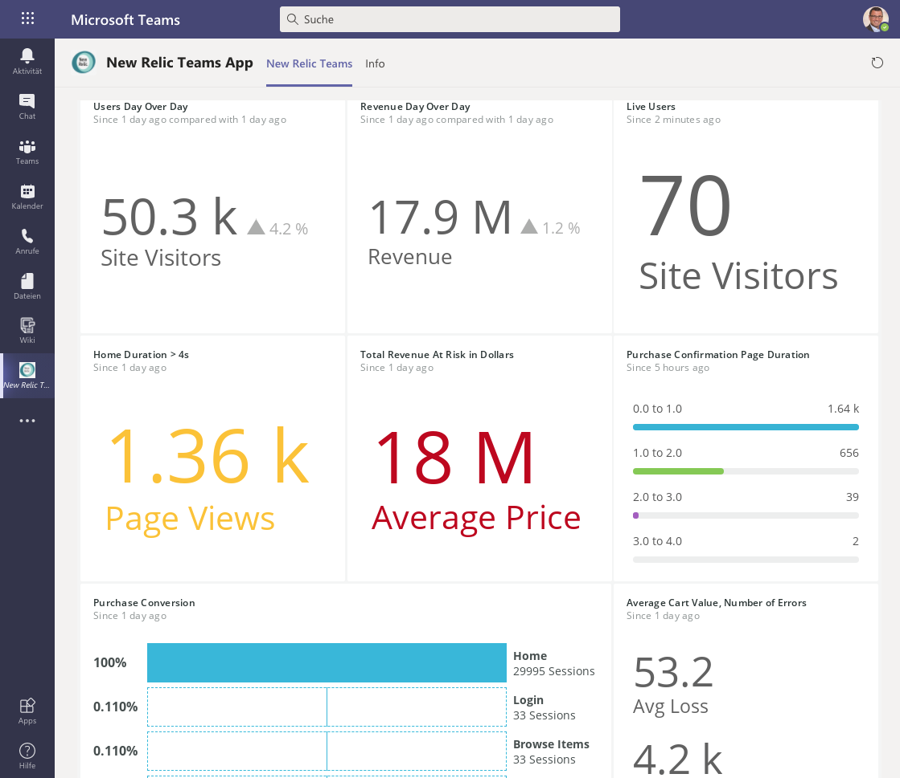

# New Relic Teams App
This Microsoft Teams app consists of two components:
1. An Azure Function that basically delivers a custom web app with an HTTP trigger
2. The Microsoft Teams specification that can be configured using the built-in App Studio

## Azure Function
The Azure Function can be created without any specific requirements to keep in mind. You can simply create a Function App and add a HTTP triggered function. The code used here is based on Node.js,m but you can actually also adopt it to any other language of your choice.

To customize the function you need to speficy a couple of Azure Functions Application Settings:
1. **NEWRELIC_USER_KEY**: the New Relic user API key
2. **NEWRELIC_DASHBOARD_ENTITYGUID**: the entity GUID of the dashboard you want to display in Microsoft Teams
3. **REFRESH_INTERVAL**: the refresh interval for the dashboard to automatically refresh
4. **IS_REFRESH_PAGE**: an indicator on whether you want to refresh (true) the dashboard within the Microsoft Teams app or not (false)

## Microsoft Teams App
To configure the Microsoft Teams App, the easiest way to achieve this is by using the files in the **NewRelicTeamsApp** folder. You need to customize the staticTabs part of the manifest.json and enter the appropriate contentUrl from the Azure Function.

